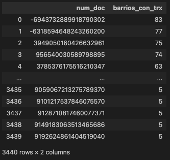
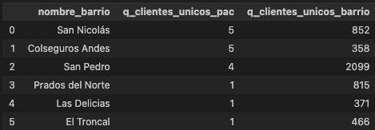
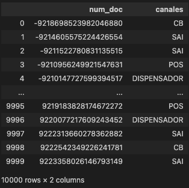
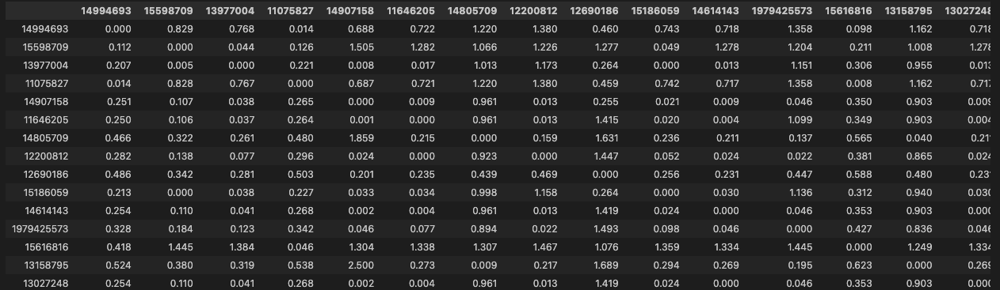
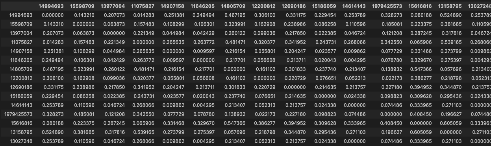
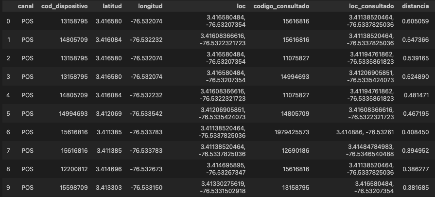

# Solución prueba técnica

## Punto 2
### Descripción:
Su tarea es proporcionar un diagrama de entidad-relación (ER) que muestre las entidades
relevantes en el conjunto de datos, sus atributos y las relaciones entre ellas. Además, debe
proporcionar un esquema de base de datos que muestre cómo se traduciría el modelo ER en
una estructura de tabla relacional.

### Solución:
Para esto encontramos en el directorio "modelo_datos" el pdf con el modelo ER en la estructura requerida, junto con el código utilizado para crearla en la herramienta online "https://dbdiagram.io" usando el DBML (Database Markup Language).

## Punto 3: Prueba de programación
En esta fase, deberás construir bases para un posterior análisis de datos. Se te entregarán tres bases de datos de las cuales deberás buscar una relación para consolidarlas en una sola, dichas bases brindarán información sobre las transacciones por barrio de cada uno de los clientes y el dispositivo usado para dichas transacciones. Para la construcción de estas bases deberás utilizar SQL y Python para resolver cada uno de los puntos.

### Q1: Generar el listado de clientes con transacciones en 5 o mas barrios
Llamamos la función que resuelve la pregunta uno y nos arroja el dataFrame con el listado de clientes con transacciones en 5 o más barrios

### Q2: ¿Cuáles son los 6 barrios donde la mayor cantidad de clientes únicos realizan transacciones en dispositivo tipo PAC?
Llamamos la función que resuelve la pregunta dos y nos arroja el dataFrame con el listado de los 6 barrios donde la mayor cantidad de clientes únicos realizan transacciones por dispositivo tipo PAC

### Q3: ¿Cuáles son los canales usados por cada cliente, es decir, los canales donde realiza al menos el 51% de sus operaciones?
Llamamos la función que resuelve la pregunta tres y nos arroja el diccionario donde tenemos en las llaves los clientes (unicos) y en los valores el listado de canales que representan más del 51% de sus transacciones

### Q4: ¿Cuáles son las 10 distancias únicas de los dispositivos mas alejados entre si pertenecientes al barrio panamericano?
Llamamos la función que resuelve la pregunta dos y nos arroja tres dataFrames, el primero con la matriz de distancias calculadas con la api de Waze, el segundo con matriz de distancias calculadas con geoPy y por ultimo el listado de los 10 dispositivos únicos con mayor distancia entre si

