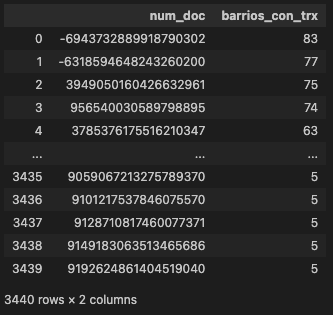
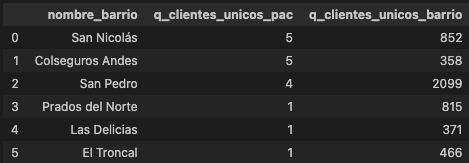
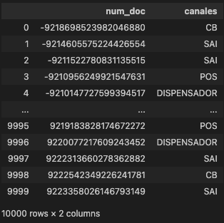
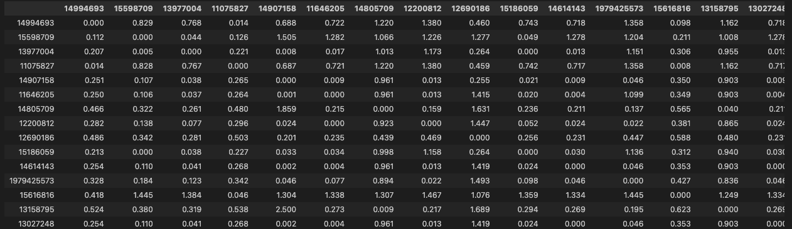
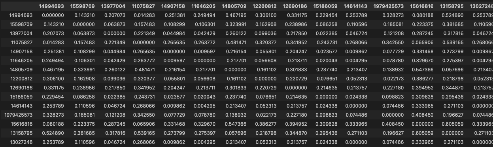
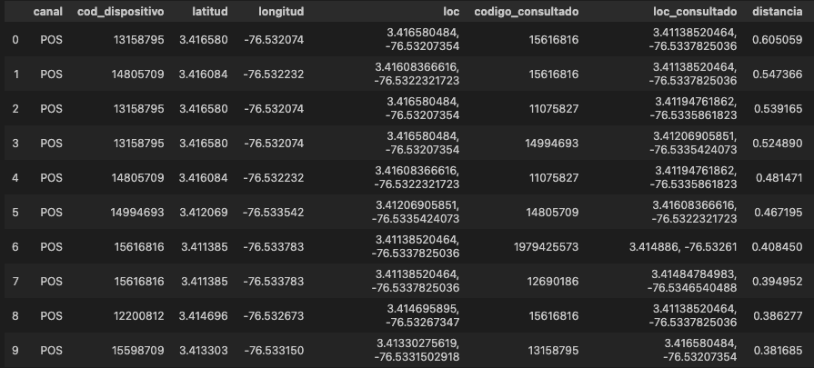

# Solución prueba técnica

## Punto 2
### Descripción:
Su tarea es proporcionar un diagrama de entidad-relación (ER) que muestre las entidades
relevantes en el conjunto de datos, sus atributos y las relaciones entre ellas. Además, debe
proporcionar un esquema de base de datos que muestre cómo se traduciría el modelo ER en
una estructura de tabla relacional.

### Solución:
Para esto encontramos en el directorio "modelo_datos" el pdf con el modelo ER en la estructura requerida, junto con el código utilizado para crearla en la herramienta online "https://dbdiagram.io" usando el DBML (Database Markup Language).

## Punto 3: Prueba de programación
En esta fase, deberás construir bases para un posterior análisis de datos. Se te entregarán tres bases de datos de las cuales deberás buscar una relación para consolidarlas en una sola, dichas bases brindarán información sobre las transacciones por barrio de cada uno de los clientes y el dispositivo usado para dichas transacciones. Para la construcción de estas bases deberás utilizar SQL y Python para resolver cada uno de los puntos.

### Q1: Generar el listado de clientes con transacciones en 5 o mas barrios
Llamamos la función que resuelve la pregunta uno y nos arroja el dataFrame con el listado de clientes con transacciones en 5 o más barrios

### Q2: ¿Cuáles son los 6 barrios donde la mayor cantidad de clientes únicos realizan transacciones en dispositivo tipo PAC?
Llamamos la función que resuelve la pregunta dos y nos arroja el dataFrame con el listado de los 6 barrios donde la mayor cantidad de clientes únicos realizan transacciones por dispositivo tipo PAC

### Q3: ¿Cuáles son los canales usados por cada cliente, es decir, los canales donde realiza al menos el 51% de sus operaciones?
Llamamos la función que resuelve la pregunta tres y nos arroja el diccionario donde tenemos en las llaves los clientes (unicos) y en los valores el listado de canales que representan más del 51% de sus transacciones

### Q4: ¿Cuáles son las 10 distancias únicas de los dispositivos mas alejados entre si pertenecientes al barrio panamericano?
Llamamos la función que resuelve la pregunta dos y nos arroja tres dataFrames, el primero con la matriz de distancias calculadas con la api de Waze, el segundo con matriz de distancias calculadas con geoPy y por ultimo el listado de los 10 dispositivos únicos con mayor distancia entre si

### Q5: Después de responder los puntos anteriores deberás crear un módulo el cual debe implementar un constructor para inicializar dicho modulo y crear un método por cada uno de los puntos solucionados.
Para este punto se construyen los modulos utils.py, main.py en el directorio "src" donde se encuentran también los directorios "datos" y "queries" que contienen los archivos planos de datos y las consultas a realizar sobre la sabana de datos levantada para responder las 4 preguntas de la prueba.

Adicional en la raíz se construyen los archivos requirements.txt y "dockerfile" que permiten levantar la imagen de docker con todas las dependencias necesarias para correr el proceso en un contenedor.

Finalmente se publica el repositorio en mi cuenta personal de github para que sea clonado y testeado.
URL del repositorio: https://github.com/Pabloc98/prueba_nq/tree/main

## Punto 4: Reportería
Para este punto se construye un dashboard interactivo en la herramienta QuickSight de AWs en mi cuenta personal (version gratuita). En este reporte se usa la sabana de datos construida al iniciar el punto 3 y también se utilizan los outputs resultados del presente código para visualizar las respuestas a las preguntas.

URL del reporte (Interactivo): https://us-east-1.quicksight.aws.amazon.com/sn/accounts/321699386495/dashboards/4ef36579-e25d-4409-946d-a365469faf1e?directory_alias=bilabmaster

URL del reporte (PDF): https://github.com/Pabloc98/prueba_nq/blob/main/anexos/reporte_prueba_nq.pdf

## Punto 5: Preguntas de Riesgo de Crédito
### Q1: ¿Cómo interpreta usted el indicador de rodamiento?

Para dar mi interpretación de la tasa de rodamiento quisiera abordarlo desde dos frentes, en primera instancia desde un punto de vista matemático es simple, entre más cerca a 1 sea la tasa de rodamiento menos variación hay en el saldo del capital en el periodo actual en comparación con el periodo inicial. Contrastando esto con el segundo punto de vista más "practico", se entiende que si en el periodo actual el numerador (saldo actual) es mucho menor que el denominador (saldo inicial) la tasa de rodamiento tenderá a ser más cercana a 0 y por lo tanto se entendería que hay un mayor "avance" en el pago de la deuda.

En conclusión mi forma de interpretar la tasa de rodamiento es que es un indicador de "salud" del avance de la deuda y se podría decir que tiene una relación inversa con dicho avance, a mayor tasa de rodamiento (más cercana a 1) menor avance en el capital de la deuda.

### Q2: ¿Cómo interpreta usted el indicador de cartera vencida?

Mi interpretación del indicador de cartera vencida, abordado con la misma lógica que el punto anterior, indicaría el estado de salud del credito donde la relación sería directa. Es decir, entre mayor sea el indicador de cartera vencida (más cercano a 1) mayor es la proporción del saldo que se encuentra vencido (mora).

### Q3: ¿Cómo interpreta usted las siguientes cosechas? ¿Que podría concluir sobre las mismas? ¿Qué información adicional utilizaría para poder concluir?

NSNR

